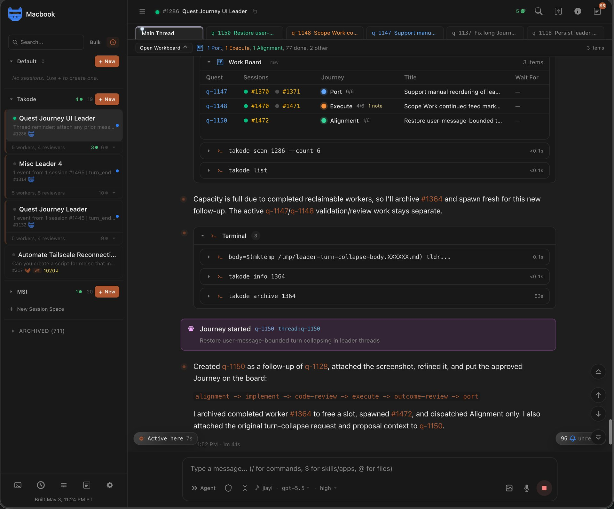
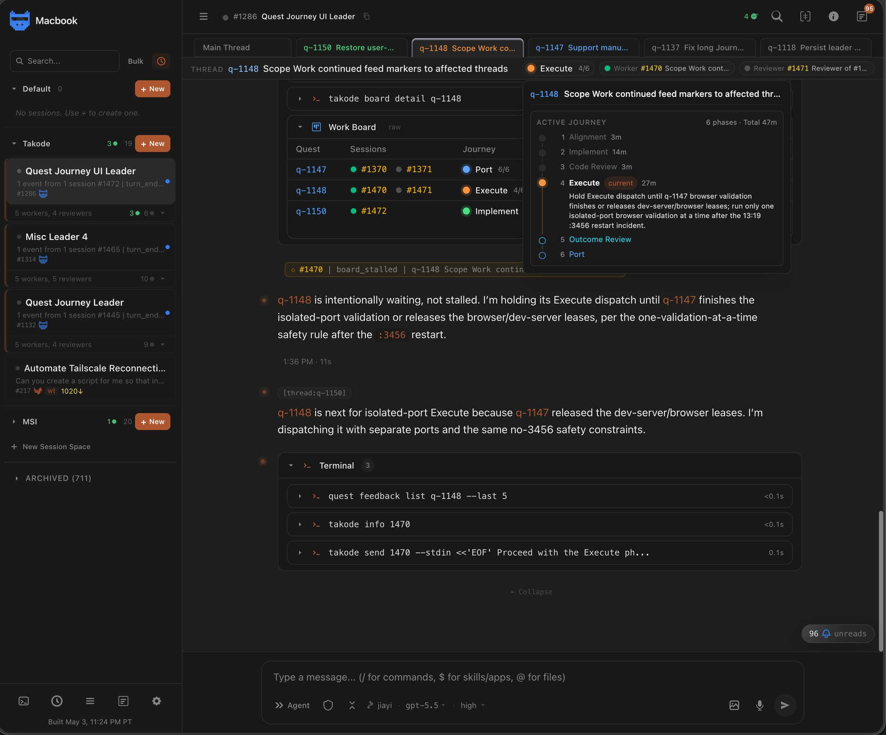
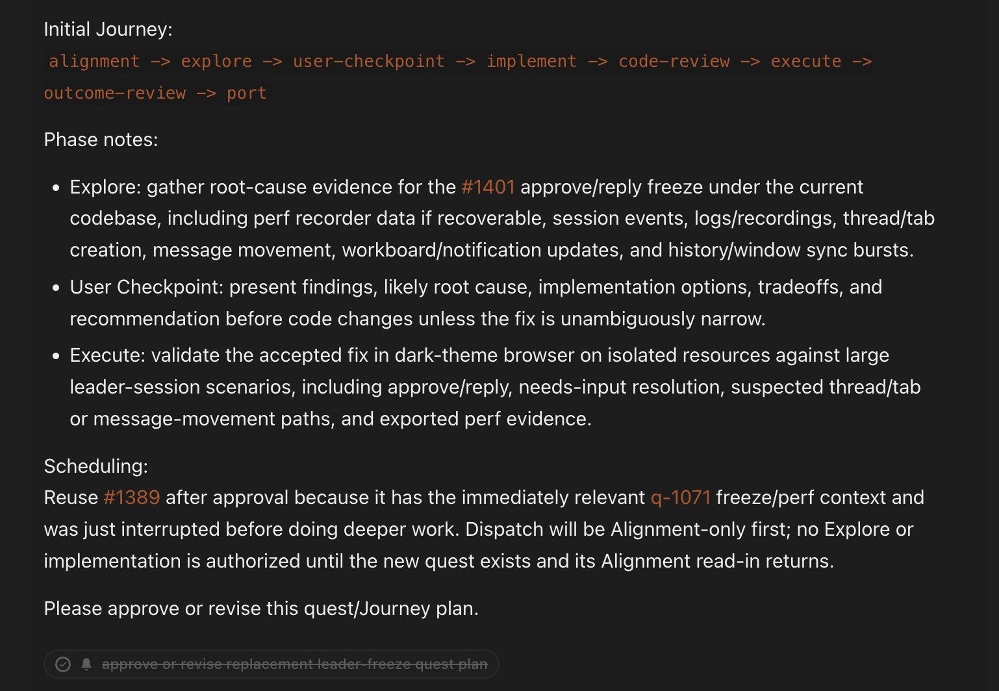
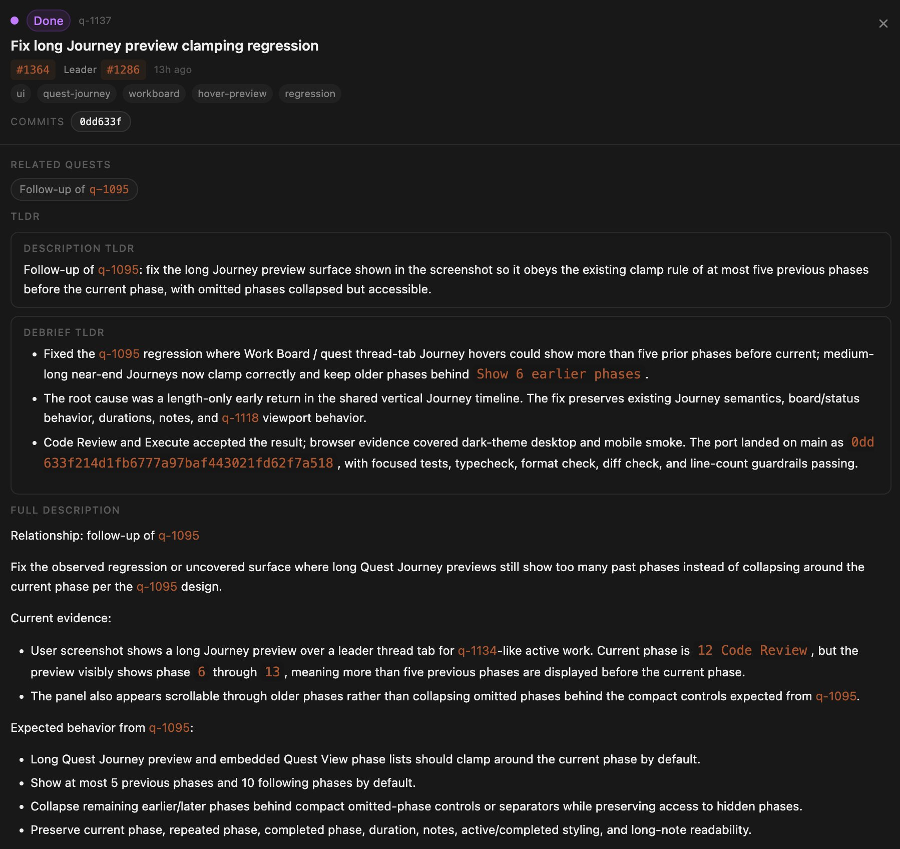
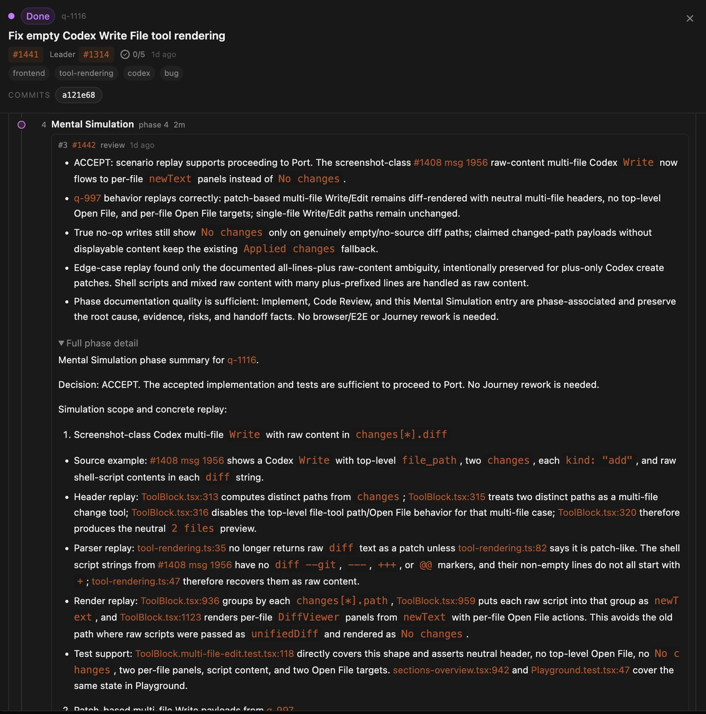

# Takode's reimagined leader orchestration system

Long-running work in Takode often involves more than one thing happening at once. A leader might be planning one quest, checking on another, waiting for a reviewer, and starting a follow-up while the original conversation keeps moving. The old leader-session conversation put all of that into one stream. It was complete, but it was also hard to scan: unrelated quests mixed together, progress context was easy to miss, and a Journey that lasted through many handoffs could turn into a wall of history.

This release overhauls the leader session conversation experience. The redesigned Quest Journey experience keeps the completeness of the old model while giving each quest a clearer home.

## Main is the staging view

The Main thread is still the global view of the leader session. It is where new work is staged, high-level decisions happen, and cross-quest coordination stays visible. The Work Board now sits naturally in that Main view as a compact operating map: what is active, which phase each quest is in, who is assigned, what is waiting, and how much work is already done.

That means Main no longer has to be both the full transcript and the only way to understand progress. It can show the big picture without making every quest compete for the same line of attention.

## Each quest gets a focused thread

When a quest needs detailed work, the leader can give it its own thread inside the leader session. That thread is where you talk to the leader about the quest while also seeing the leader's orchestration activity recorded in context: tool output, worker handoffs, reviewer updates, decisions, and status changes. The quest thread also carries the active phase, worker and reviewer context, and quick access back to the full Journey.

This is the biggest day-to-day change: you can follow one quest without losing the rest of the session. Main remains the staging and overview space, while the quest thread becomes the focused workspace.

The leader manages that structure for you. It can create a quest thread, attach relevant existing Main-thread messages to it, and keep the same context visible in the places where it still matters. Earlier Main discussion can stay visible in Main while also appearing in the quest thread, so the original conversation does not lose its shape just because part of it became quest-specific.

You can still open worker sessions when you need to inspect or steer a worker directly. The new default is simpler: talk to the leader session, let the leader coordinate the workers and reviewers, and keep the orchestration context in one place across multiple simultaneous quests.

## Journeys are planned, visible, and revisable

Quest Journeys are now flexible plans instead of a fixed checklist hidden in leader prose.

Before dispatch, the leader can propose a Journey for the quest. You can ask the leader to change that proposal: add a review step, skip an unnecessary phase, insert a user checkpoint, or adjust the order based on risk. Once approved, the Journey becomes the active plan on the Work Board.

The plan can also change later. If exploration finds that the problem is larger than expected, the leader can revise the remaining Journey. If review finds a narrow issue, the Journey can loop through another implementation and review pass. If a result needs your judgment before the work continues, the leader can stop at a User Checkpoint instead of guessing.

The important shift is that the Journey is no longer just a promise made at the beginning. It is structured state the leader can show, discuss, and revise as evidence changes.

## The built-in phases

Takode now has a small set of built-in Journey phases. They are not a normal to-do list. A to-do list breaks work into task steps; a Quest Journey breaks orchestration into higher-level stages. Each phase has a distinct purpose, a standard for what must be known or done before advancing, and sometimes a different session responsible for the work. Some phases are mostly worker-owned, some are reviewer-owned, and some explicitly require communication or confirmation from you.

- **Alignment**: align the worker session with the leader's understanding of the goal, constraints, ambiguities, and planned Journey.
- **Explore**: gather evidence when the next route is genuinely uncertain or investigation is the deliverable.
- **Implement**: make the approved change or artifact, including the normal reading and local checks needed to do it well.
- **Code Review**: have a reviewer session inspect tracked code or artifacts for correctness, regressions, maintainability, and missing tests.
- **Mental Simulation**: have a reviewer session replay a design or workflow against concrete scenarios before committing to it.
- **Execute**: run expensive, risky, long-running, or externally consequential actions under explicit monitor and stop conditions.
- **Outcome Review**: have a reviewer session judge whether external results, logs, metrics, generated artifacts, or UX evidence satisfy the goal.
- **User Checkpoint**: stop for your decision when the work has produced options, tradeoffs, or a material direction change.
- **Bookkeeping**: record durable state that future sessions need, such as artifact locations, superseded facts, or final handoff details.
- **Port**: sync accepted tracked changes back to the main repository.

Most quests do not need every phase. The point is to use the phases that match the risk of the work and make the handoff between sessions explicit.

## Long Journeys become readable memory

A Journey can be short, but real work often loops: implement, review, implement again, validate, review the outcome, then port. The new UI treats that as normal. Repeated phases can appear as distinct steps, phase notes can explain why a step exists, and long Journey previews collapse around the current phase so the useful context stays visible.

This makes the Journey useful while work is active. You can quickly see where the quest is, what came before, what is next, and why a phase is waiting.

Quest records now support detailed phase documentation plus human-readable TLDRs. The detailed text gives future agents enough evidence to continue or audit the work. The TLDRs give people a fast way to scan what happened without reading every note. Final debriefs preserve the story of the quest: what problem drove the work, what changed, why that solution was chosen, and what risks or follow-ups remain.

This turns a completed quest into more than a status row. It becomes a compact memory object for the project.

## Why this design landed

Several ideas shaped the final experience. Some early designs emphasized hiding leader activity or pushing status into a separate panel, but that made it too easy to lose the story. Other iterations focused on moving messages between threads, but moving context out of Main created confusing gaps. The final direction keeps Main complete enough to be trustworthy, adds quest threads for focus, and uses the Work Board and TLDRs to make the state scannable.

The result is a calmer orchestration experience: less interleaving, clearer ownership, visible progress, and better handoffs. You can watch the whole session from Main, dive into a single quest when needed, ask the leader to reshape the Journey, and come back later to a record that still explains what happened.
